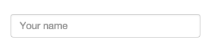
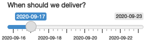

# Basic UI

## Inputs

**E1:** When space is at a premium, it's useful to label text boxes using a placeholder that appears *inside* the text entry area. How do you call `textInput()` to generate the UI below?

```{r, echo=FALSE, out.width='%40'}

```

**Solution:**

```{r, eval=FALSE}
textInput("text", "", placeholder = "Your name")
```

**E2:** Carefully read the documentation for `sliderInput()` to figure out how to create a date slider, as shown below.

```{r, echo=FALSE, out.width='%40'}

```

**Solution:**

```{r, eval=FALSE}
sliderInput(
  "delivery",
  "When should we deliver?",
  min = as.Date("2020-09-16"),
  max = as.Date("2020-09-23"),
  value = as.Date("2021-09-17")
)
```

**E3:** Create a slider input to select values between 0 and 100 where the interval between each selectable value on the slider is 5. Then, add animation to the input widget so when the user presses play the input widget scrolls through the range automatically.

**Solution:** 

```{r, eval=FALSE}
sliderInput(
  "number", 
  "Select a number:",
  min = 0, 
  max = 100, 
  value = 0, 
  step = 5, 
  animate = TRUE
)
```

**E4:** If you have a moderately long list in a `selectInput()`, it’s useful to create sub-headings that break the list up into pieces. Read the documentation to figure out how. (Hint: the underlying HTML is called `<optgroup>`.)

**Solution:**

```{r, eval=FALSE}
selectInput(
  "movie",
  "Select your favourite action movie:",
  choices =
    list(
      "Chose one" = "", # placeholder
      "Guy Ritchie" = list('Lock, Stock, and Two Smoking Barrels', 'Snatch', 'RocknRolla'),
      "Quentin Tarantino" = list('Reservoir Dogs', 'Pulp Fiction', 'Kill Bill')
    )
)
```

## Outputs

**E1:**

**Solution:**

**E2:**

**Solution:**

**E3:**

**Solution:**

**E4:**

**Solution:**