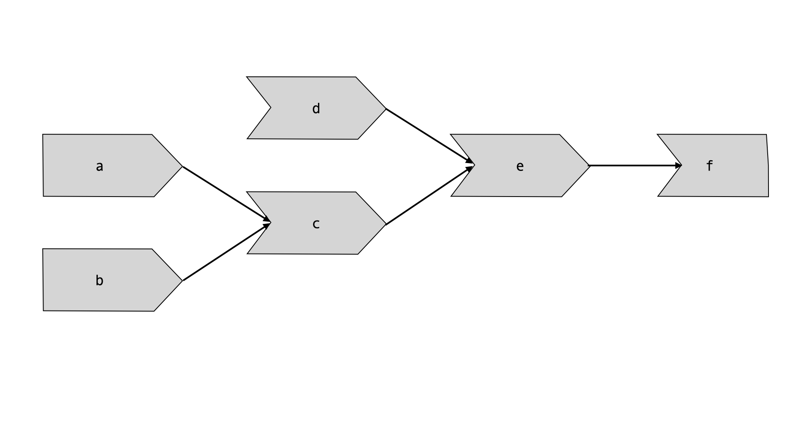
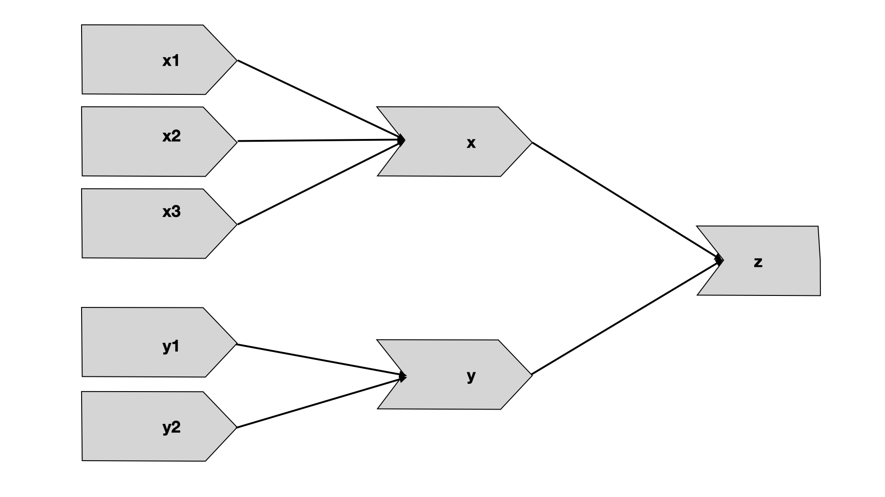
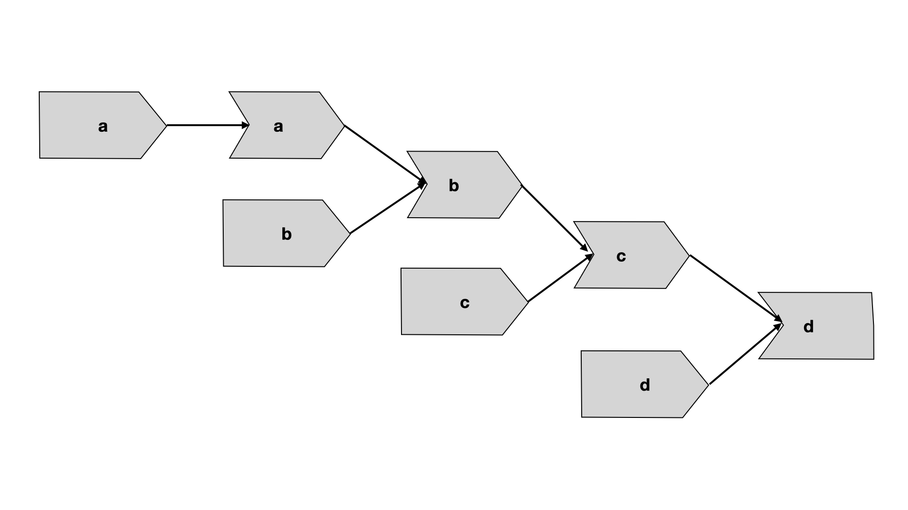

# Basic Reactivity

## Reactive programming

**E1:** Given this UI:

```{r, eval=FALSE}
ui <- fluidPage(
  textInput("name", "What's your name?"),
  textOutput("greeting")
)
```

Fix the simple errors found in each of the three server functions below. First try spotting the problem just by reading the code; then run the code to make sure you’ve fixed it.

```{r, eval=FALSE}
server1 <- function(input, output, server) {
  input$greeting <- renderText(paste0("Hello ", name))
}

server2 <- function(input, output, server) {
  greeting <- paste0("Hello ", input$name)
  output$greeting <- renderText(greeting)
}

server3 <- function(input, output, server) {
  output$greting <- paste0("Hello", input$name)
}
```

**Solution:**

```{r, eval=FALSE}
server1 <- function(input, output, server) {
  output$greeting <- renderText(paste0("Hello ", input$name))
}

server2 <- function(input, output, server) {
  greeting <- reactive(paste0("Hello ", input$name))
  output$greeting <- renderText(greeting())
}

server3 <- function(input, output, server) {
  output$greeting <- renderText(paste0("Hello ", input$name))
}
```

**E2:** Draw the reactive graph for the following server functions:

```{r, eval=FALSE}
server1 <- function(input, output, session) {
  c <- reactive(input$a + input$b)
  e <- reactive(c() + input$d)
  output$f <- renderText(e())
}
server2 <- function(input, output, session) {
  x <- reactive(input$x1 + input$x2 + input$x3)
  y <- reactive(input$y1 + input$y2)
  output$z <- renderText(x() / y())
}
server3 <- function(input, output, session) {
  d <- reactive(c() ^ input$d)
  a <- reactive(input$a * 10)
  c <- reactive(b() / input$c) 
  b <- reactive(a() + input$b)
}
```

**Solution:**

`server1`

```{r, echo=FALSE}

```

`server2`

```{r, echo=FALSE}

```

`server3`

```{r, echo=FALSE}

```

**E3:** Why will this code fail?

```{r, eval=FALSE}
var <- reactive(df[[input$var]])
range <- reactive(range(var(), na.rm = TRUE))
```

Why are `range()` and `var()` bad names for reactive?

**Solution:** 

These names are already taken by `base::range()` and `stats::var()`. Using them for naming reactive expressions makes Shiny confused. In this case code will fail because when defining `range()` Shiny takes `var()` as a function instead of a reactive object.

Overriding on existing functions or variables is bad practice. It may cause conflicts or errors, as just happened here.